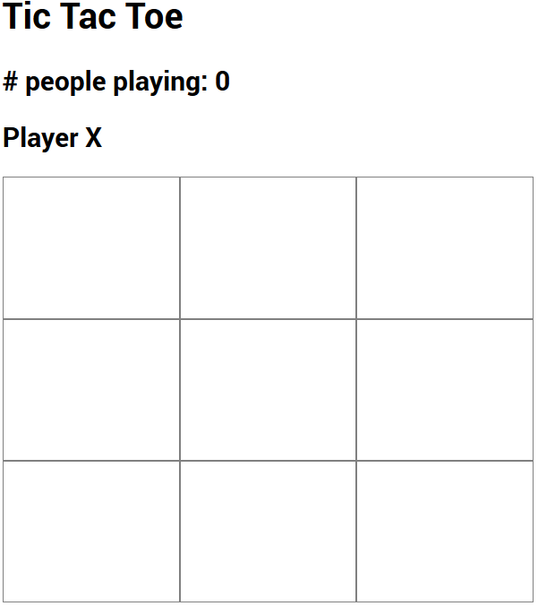

# Svelte Tictactoe

A multiplayer TicTacToe App. Follow the amazing [tutorial](https://youtu.be/ujbE0mzX-CU) by Noah.
 
# Setup
- Follow the steps on [https://github.com/phptuts/tictactoe-server](https://github.com/phptuts/tictactoe-server) to start the local server
- Clone the repo
- `npm install`
- `npm run dev`

